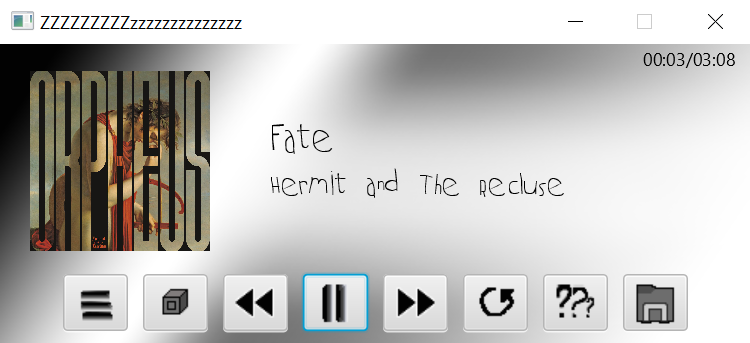
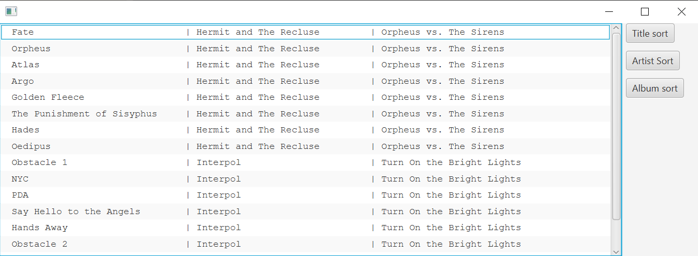

# Mp3 mängija v.2
Sander Soodla, Ingvar Drikkit
***

## Kirjeldus
Projekti eesmärgiks oli luua lihtsa kasutajaliidesega mp3 failide mängija. Tahtsime luua programmi, mis
loeb kaustas olevate mp3 failide ID3 märgiseid ning võimaldab kasutajal laule programmi *playlist*-is sorteerida ning käivitada.
ID3 siltide lugemiseks kasutasime [**mp3agic**](https://github.com/mpatric/mp3agic) teeki ning laulude käivitamiseks rakendasime [**JavaFX**](https://openjfx.io)-i. Programmil kasutusjuhendit
enam sisseehitatud pole, aga nuppude ikoonid võiksid muusikamängija kontekstis piisavalt kirjeldavad olla (siin lahedat loop või shuffle toggle funktsiooni kahjuks pole). Alati saab ka nuppe katsetada. Klaviatuurisisenditeks on tähed:
- J - käivitab eelmise laulu
- K - paneb laulu käima/pausile
- L - käivitab järgmise laulu
***
## Klassid
### Song
Laulu klass laiendab mp3agic teegis olevat *MP3File* klassi, lisades sellele isendiväljad, kus hoitakse infot ID3 siltide 
kohta. Klassil on ka isendiväli *MediaPlayer*-i jaoks, et helifaili oleks selle välja kutsumisel lihtne käivitada. Peale 
konstruktori ja erinevate *get*-meetodite on selles klassis ka kolm *Comparator*-i, mis võimaldavad hiljem sorteerida 
selle klassi isendeid nii laulu pealkirja, esitaja kui ka albumi järgi.
### MusicCollection
Muusikakollektsiooni klass hoiab endas *Arraylist*-i, kuhu lähevad *Song* objektid. Meetod *setSongList* võtab argumendiks
kausta asukoha ning lisab kaustas olevad mp3 failid listi. Klassis on veel meetodid listi sorteerimiseks (*Song* klassis olevate *Comparator*-ite põhjal).
Klassi on lisatud ka *Arraylist*, mis hoiab alglaadimisel tekitatud listi. See on selleks, et sorteerimisel ei tekiks erinevate järjestikuste sorteerimiste korral anomaaliaid.
### ~~MediaControl~~
~~Klass, milles toimub suhtlus kasutajaga ja mängija juhtimine.
Realiseerib *Runnable* liidest, pannakse tööle eraldi lõimes.
olulisem meetod:
*mediaControlWithTextInput()*~~
See klass pole vajalik, sest suhtlus ei toimu enam läbi terminali.
### MainApp
Programmi põhiline osa. Loob MediaView, MusicCollection isendid, tekitab JavaFX-i abil kasutajaliidese. 
Kasutajaliides võimaldab lisaks laulude mängimisele/peatamisele, järgmise/eelmise/sama/suvalise laulu valimisele ka valida kausta, 
kust muusikat mängitakse ja avada playlist'i akna. Playlist'i saab sorteerida vastavalt pealkirjale, artistile või albumile. 
Kasutajaliides näitab ka laulu kestust ning kui üks laul lõppeb, hakkab nimekirjas järgmine käima
***
## Protsess ja panus
- **Sander 1. töö** - JavaFX-i media module'i jaoks Gradle projekti üles seadmine, MainApp ja MediaControl klassid.\
Orienteeruv ajakulu: ~9 tundi
- **Sander 2. töö** - Keyboard ja hiirega vajutatavate nuppude funktsionaalsus, koodi warningute korrastamine ~4 tundi
- **Ingvar 1. töö** - MusicCollection ja Song klasside kirjutamine, nimetatud klasside ja mp3agic teegi Gradle projekti integreerimine.\
  Orienteeruv ajakulu: ~6 tundi
- **Ingvar 2. töö** - GUI üldine disain ~8 tundi
***
## Mured
JavaFX pakub küll palju erinevaid võimalusi oma ideede realiseerimiseks, kuid samas oli kohati keeruline aru saada, kus koodis probleemid said tekkida.
Kood muutus seetõttu kiiresti kirjuks ja halvasti loetavaks, sest teatud osade töölesaamiseks tuli lihtsalt katsetada ja ridu ümber tõsta. Praegu võib probleeme tekitada ka see, kui sorteerimisaknaid tehakse üle ühe korraga lahti, ilmselt on kerge fix, aga üleliia tööd ei häiri see niikuinii.
Selle töö tähtaeg saabus ka kuidagi ootamatult.
***
## Hinnang
- **Sander 1. töö** - Hästi: töötab.
- **Sander 2. töö** - Panustasin ise GUI tegemisse liiga vähe, aga programm töötab ja on päris vinge.
- **Ingvar 1. töö** - Projekti alguses seatud eesmärgid said täidetud, mis on positiivne. Kindlasti on programmi töös lünkasid, 
  mida tuleb parandada. Veahalduse, graafilise liidese ja muu sellisega tegelemegi projekti teises pooles.
- **Ingvar 2. töö** - Kood näeb halb välja, aga vähemalt töötab.
***
## Testimine
Proovisime programmi tööd erinevate mp3 failidega. Hetkel on eelduseks, et failid on viisakalt 
sildistatud. Kaustas võivad nüüd olla ka teist tüüpi failid, kui programm ei saa nende lugemisega hakkama, siis need jäetakse vahele lihtsalt.
***

